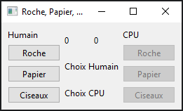

# Roche, Papier. Ciseaux

## Recréer l'interface d'un jeu de Roche, Papier, Ciseaux
1) Recréer l'interface ci-dessous avec les divers gestionnaires de géométrie (layouts) dans la classe
RochePapierCiseaux(QMainWindow)
   1) L'interface est constituée
      1) d'une section pour le joueur humain 
      2) d'une section pour la table de jeu
         1) Contient le score pour l'humain et le cpu (QLabel)
         2) Contient 2 QLabels qui permettra d'afficher le choix de chaque joueur
      3) d'une section pour le joueur cpu (est similaire à la section humain mais avec les widgets désactivés)
      

2) Créer une classe Joueur avant votre classe RochePapierCiseau
   1) Le joueur devra avoir
      1) nom: string
      2) score: int
      3) isCpu: boolean

3) Implémenter un jeu de base de Roche, Papier, Ciseaux
   1) instancier les deux joueurs (humain et cpu)
   2) connecter le choix de l'humain à une méthode qui pourra gérer le choix
   3) utiliser un choix au hasard pour le cpu (ex: Random.choice())
   4) Résoudre le gagnant
      1) Afficher les choix de chaque Joueur sur la table de jeu avec les images png correspondantes (essayez de limiter la grandeur)
      2) Augmenter le score du Joueur gagnant
      3) Afficher le nouveau score dans les QLabel

<a href="https://www.flaticon.com/free-icons/rock" title="rock icons">Rock icons created by Icongeek26 - Flaticon</a>  
<a href="https://www.flaticon.com/free-icons/origami" title="origami icons">Origami icons created by Smashicons - Flaticon</a>  
<a href="https://www.flaticon.com/free-icons/scissors" title="scissors icons">Scissors icons created by Gulraiz - Flaticon</a>

## Compléments à venir

